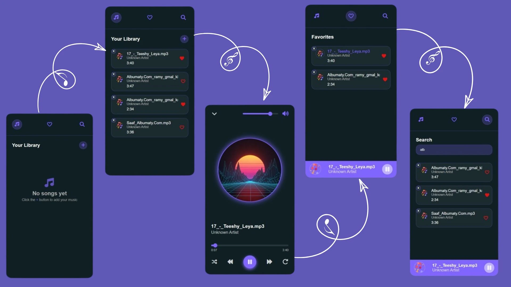

# 🎵 Music Player

An interactive web application that lets you upload, play, and manage your personal music collection easily. Enjoy full control over playback, favorites, and search, all within a modern and responsive interface.

---
## Live Demo
🔗 [View the Live Demo](https://engnada-s.github.io/CodeAlpha_MusicPlayer/)  

---
## Technologies Used

- HTML5  
- CSS3
- JavaScript (ES6+)
- FontAwesome
---

## Features

- Add local music files to the player.
- Play, pause, skip, and repeat songs.
- Random song selection.
- Favorite/unfavorite songs.
- Search songs by name.
- Show song duration and current progress.
- Volume control with a visual slider.
- Responsive design with a collapsible player summary.

---

## How to Use

1. Clone or download this repository.
2. Open `index.html` in your browser.
3. Click **Add Song** to upload your local audio files.
4. Use the player controls to play, pause, or navigate songs.
5. Click the heart icon to favorite a song.
6. Use the search bar to filter your songs.

